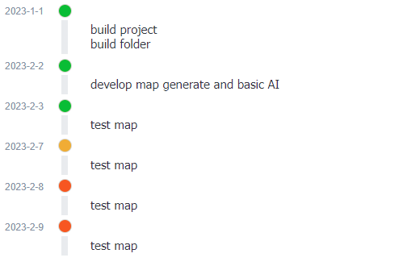

# joplin-plugin-TimelineRender

render the timeline in the markdown



# Usage

````
```timeline
2022-1-1
build project
build folder

2023-2-2
develop map generate and basic AI

2023-2-3
test map
```
````
The block start with \`\`\`timeline,end with \`\`\`

Every node is composed of time and content and is split by space line between different node.

# Acknowledgements
Hieu-Thi Luong's Life Calendar plugin,I refer to his code.

乔珂力的css时间轴教程

Joplin's offical tutorial.

# License
GPL